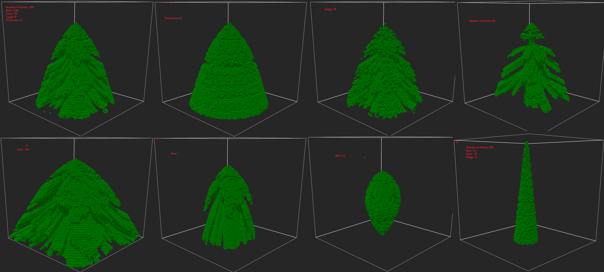

# voxelShader
Repository for magica voxel shaders.

## Installation

Install the shader by copying the file from the `shader` directory into the `shader` directory of your MagicaVoxel installation. 

## Usage

After installing the shaders (see Installation above) you should see them in the shader menu.

Use them according to the description below and try mixing them up for cool results.

### Overgrowth Shader

This shader lets you create a mossy or leafy plant or foam (you choose the color set) on your voxel art.

There are 5 parameters right now:

| Parameter | Range | Description |
| ------ | ------ | ------ |
| Max Volume | 1 to 100 |The growth width or thickness of the plants. 3 to 5 looks quite natural. 1 is interesting and higher values might cause MagicaVoxel to crash due to high computational effort. |
| Random Seed | 0 to 1.000.000 |Using the shader on the same scene will always yield the exact same result as long as you don't change this value. Play with this to yield different patterns on the same scene.  |
| Growth Density |0.000 to 1.000| 1 will look like a very thick carpet of plants while lower values will look more natural. |
| Additional Colors | (-255 to 255) | You may paint the different layers of your plant in different colors. The base Color will be the selected color but you can define a range of colors following or preceding the selected color here. |

Addition Colors is a number that defines a range of colors to follow or preced (negative sign) the currently selected color. A value of 0 means: use no additional color.

After setting your values as you like, you need to place some voxels of any colors in range of the selected color +/- the Additional Color parameter you have choosen. All colors within this range are the seed colors of your plants. This means, these colors will 'grow' if you hit the play button on the shader. 

Then hit the play button on the shader a few times to watch them grow step by step.

You can also use this command in the console to execute the shader multiple times:

xs -n 20 overgrowth 4 123.0 0.3 232 226

20 is the number of iterations (e.g. the number of times you would press the play button).
The parameter after overgrowth are the parameter defined above in the same order.

You can also use marquee select with the box select and voxel shader option to apply the shader only to a part of your scene.

#### Issues

I tested the shader with objects of max size 256 x 256 x 256. It can get really slow on this size. Also the `Max Volume` parameter should be kept under 8. I encountered some crashes when using 8 or higher. 

### Corrosion Shader

Caution! This shader will eat your voxels :). Once you place a drop of color (you choose the color set) and run the shader it will dissolve your voxels like acid. 
It's the inverse of the overgrowth shader

| Parameter | Range | Description |
| ------ | ------ | ------ |
| Max Volume | 1 to 100 |The higher this value, the deeper the shader will eat into the voxels with each step. Higher values might cause MagicaVoxel to crash due to high computational effort. |
| Random Seed | 0 to 1.000.000 | Using the shader on the same scene will always yield the exact same result as long as you don't change this value. Play with this to yield different patterns on the same scene.  |
| Growth Density |0.000 to 1.000| This defines the probability that a voxel is removed in one step. The higher the value the more aggressive the corrosion. |
| Additional Colors | (-255 to 255) | A number defining how many colors following (or preceeding) your selected color can be used as acid to corrode other voxels.|

### Patina Shader

This shader will grow a patina on your voxels. It won't create new voxels, just change the color.
It uses the same pattern as the corrosion shader and the overgrowth shader.

| Parameter | Range | Description |
| ------ | ------ | ------ |
| Max Volume | 1 to 100 | This influences the color placement pattern of the patina. Just play around with it. Higher values might cause MagicaVoxel to crash due to high computational effort. |
| Random Seed | 0 to 1.000.000 | Using the shader on the same scene will always yield the exact same result as long as you don't change this value. Play with this to yield different patterns on the same scene.  |
| Growth Density |0.000 to 1.000| This defines the probability that a voxel is painted in one step. The higher the value the more aggressive the spread of the patina. |
| Additional Colors | (-255 to 255) | A number defining how many colors following (or preceeding) your selected color will be used to paint the patina.|

### Plates Shader

This one is very versatile!

There are the current maximum of 8 parametes for you to adjust this shader.

| Parameter | Description |
| ------ | ------ |
| Mode | One of the following. <ul><li>0 - Use shader in 1-layer-a-time mode on vertical surfaces only</li><li>1 - Use the shader in 1-layer-a-time on vertical and horizontal surfaces</li><li>2 - Use the shader to fill the volume of whatever is selected if using BoxMode-Attatch with VoxelShader option</li><li>3 - Attach plates to walls and floors but distort the pattern</li><li>4 - Attach plates to floors only (no walls)</li></ul>   |
| Random Seed | Using the shader on the same scene will always yield the exact same result as long as you don't change this value. Play with this to yield different patterns on the same scene.  |
| Density | Between 0 and 1 | How compact the plates will be. This corresponds to the total number of plates as well. |
| Additional Colors | (-255 to 255) | A number defining how many colors following (or preceeding) your selected color will be used to paint the plates. Colors are distributed randomly between plates.|
| xWidth | The thickness of the plates in x direction. |
| yWidth | The thickness of the plates in y direction. |
| zWidth | The thickness of the plates in z direction. |

The last 3 properties, together with the density define the look and outcome of the shader massively. 
Try playing around with them.
Use very high xWidth and yWidth with a zWidth of 1 or change density during iterations to create interesting patterns.

### Plaster Shader

A bit like the Plates shader but it draws multiple layers of plates and only on Floors.

| Parameter | Description |
| ------ | ------ |
| Random Seed | Using the shader on the same scene will always yield the exact same result as long as you don't change this value. Play with this to yield different patterns on the same scene.  |
| Density | Between 0 and 1 | How compact the plates will be. This corresponds to the total number of plates as well. |
| Additional Colors | (-255 to 255) | A number defining how many colors following (or preceeding) your selected color will be used to paint the plates. Colors are distributed randomly between plates.|
| xWidth | A modifier to the thickness of the plates in x direction. It's not the exact width of the plates in the end. |
| yWidth | A modifier to the thickness of the plates in y direction. It's not the exact width of the plates in the end. |

### Coating Shader

Very simple shader. It adds one vertex to the outside of every existing vertex on every wall in the selection.
The color of the coat is always the currently selected color. It simply adds layers to existing wall vertices.

### Riffle Shader (Early in development)

This one cuts out vertical (mode 0) or horizontal (mode 1) lines from selected walls.
It creates an impression of windows. Use an inner box of emmissive color, coated by some wother material and then use this shader to cut glowing windows into a building.

| Parameter | Description |
| ------ | ------ |
| Max Volume | Defines multiple things. Horizontal windows (mode 1) will be bigger if this value is higher and cuts will be deeper, the higher this value is |
| Random Seed | Using the shader on the same scene will always yield the exact same result as long as you don't change this value. Play with this to yield different patterns on the same scene.  |
| Allow Roofs | 0 for no, 1 for yes. If yes, roofs will be riffled, too. Else only walls will be cut.|
| Density | Between 0 and 1. The higher this value, the lower the distance between cuts.|
| Mode | 0 for vertical cuts. 1 For horizontal cuts |

### Round Tower

Creates a cylinder which has a decreased radius at the top (if the modifier is greater than 0).
Can be used to build cakes or layered towers.
Layers can be colored differently using the Additional Colors parameter.

| Parameter | Description |
| ------ | ------ |
| Top Radius Modifier | Between 0 and 1. Defines how much the tower shrinks towards the top. A value of 1 will produce a cone. A value 0f 0.5 will create a tower with half the radius on top. |
| Slice Height | Defines how thick one slice of the tower should be. A value of higher than 1 produces kind of a birthday cake layer tower.  |
| Additional Colors | (-255 to 255) A number defining how many colors following (or preceeding) your selected color will be used to paint the layers of the tower. |

### Curve Map

This parameterless shader simpy highlights all edges and rims on a certain model in the currentyl selected color.
This can be usefull in combination with the patina shader or the overgrowth shader.

### Gravity Falling 

This shader can be used to simulate snowfall or an object made of sand, collapsing.
It casts down every voxel of the selected color to the either the next voxel of a different color or the ground.
This shader will cast down all voxels at once. So if you have 5 white voxels stacked and choose the white color, all of them will fall down an build a bile of 5 voxels. If you want to cast down voxels layer by layer, you can use the Gravity Layer shader.

### Gravity Layer 

Same as Gravity Falling but this one only pulls down the lower most voxels of the selected color, that have empty voxels below them.

### Gravity Fill 

Select a color and this shader will fill in all empty voxels below all voxels of the selected color. 
For example if you draw a stair with only the top voxels, this shader can fill in the supporting voxels below it.

### Stone Shader

This one uses Voronoi to create stone like polygonal shapes.

| Parameter | Description |
| ------ | ------ |
| Scale | No magic here ^^. This defines how big the rock will be. When this is to high, the cluster size might no affect anything sinze this defines also kind of the zoom into a scene |
| Seed | Using the shader on the same scene will always yield the exact same result as long as you don't change this value. Play with this to yield different patterns on the same scene.  |
| Cluster | Raising this can either result in mutliple stones or more complex stone shapes as multiple stones are mixed together to create a new one |

### Fir Tree

This shader creates objects in the shape of fir trees. There are some parameters to adjust the outcome.

| Parameter | Description |
| ------ | ------ |
| Random Seed | Using the shader on the same scene will always yield the exact same result as long as you don't change this value. Play with this to yield different patterns on the same scene.  |
| Number of Random Points | This will influence the number of "branches" of the tree. |
| Bow | This defines how much the branches will bow down. A value of 1 means straight down. Choose a number higher than 1 to curve the branches inward which will create some floating, drop like, objects|
| Cone | This defines the steepness of the tree. A small value results in a spiky tree while a high value will make it bigger and bigger |
| Zaggy | This will add and delete some random voxels along the branches making the tree look more bushy|
| Thickness | This defines the vertical density of the branches. A high value will make the tree look like a full cone. A too low value may result in only one branch or no braches at all |

